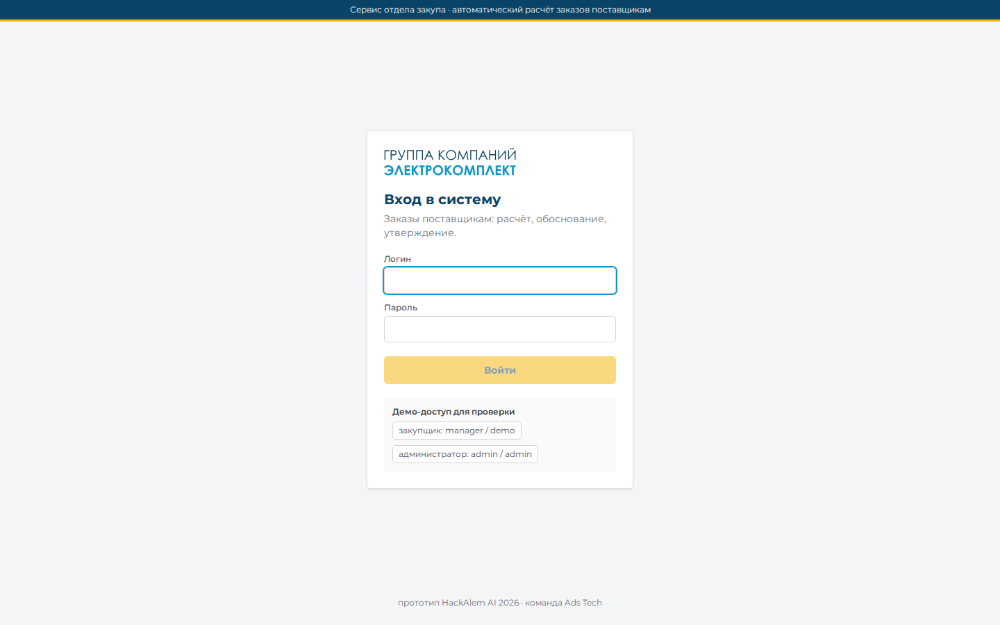
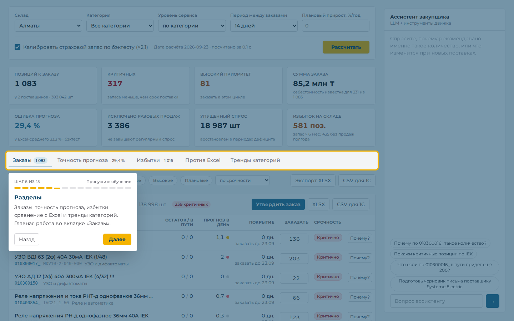
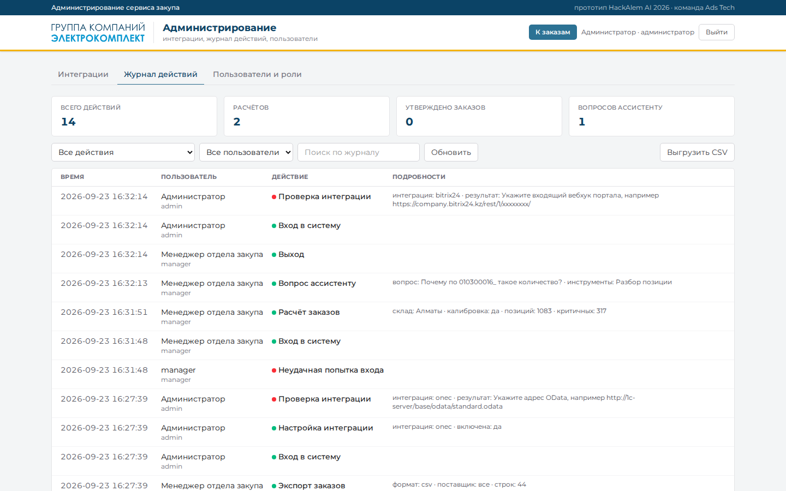
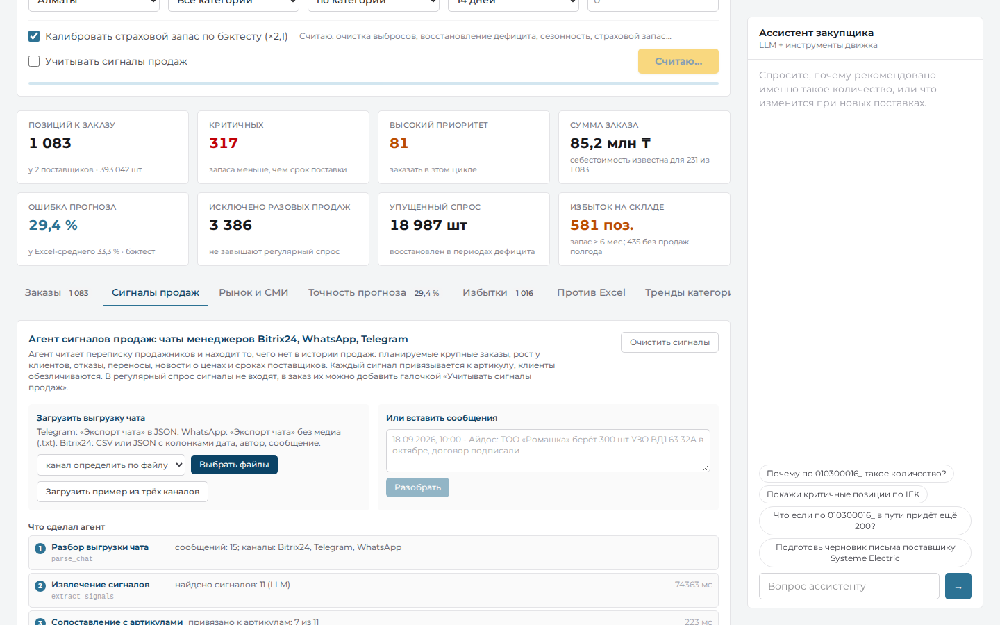
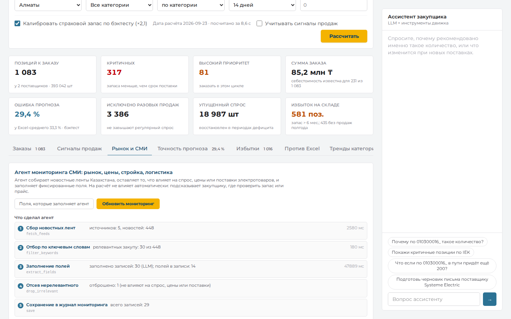
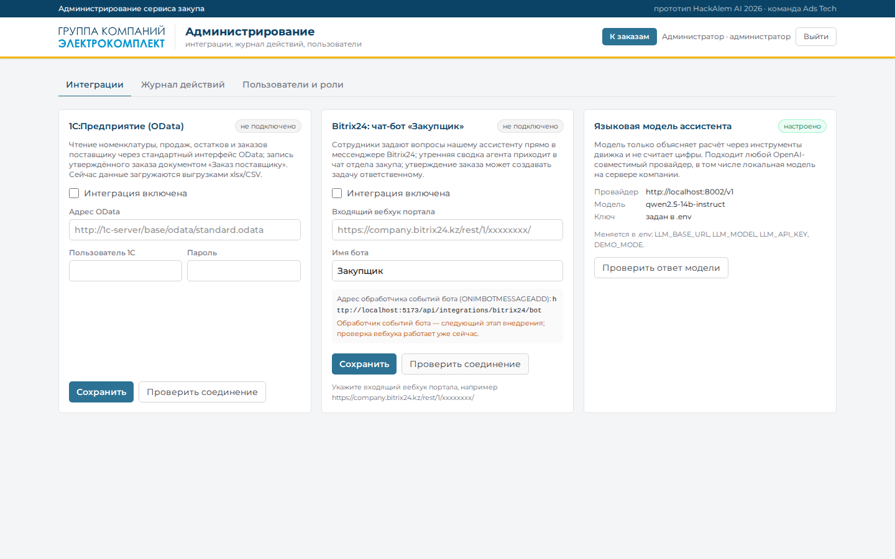
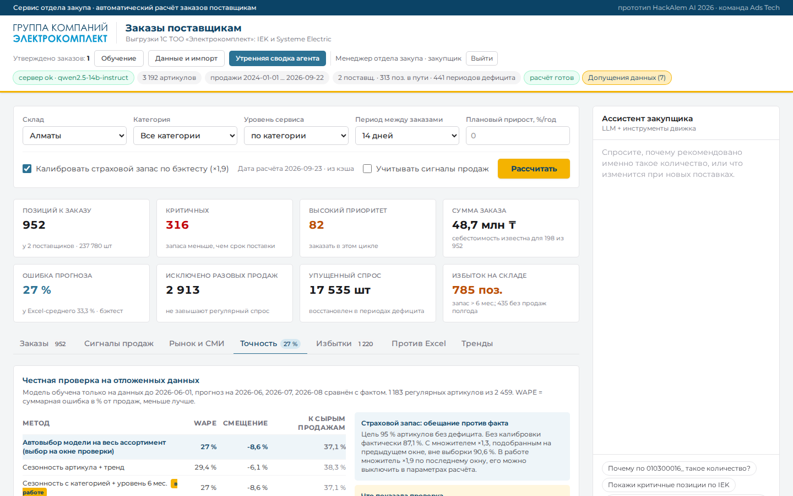
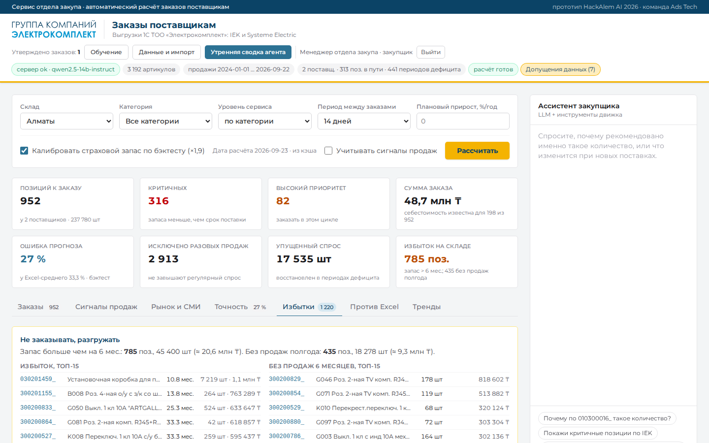
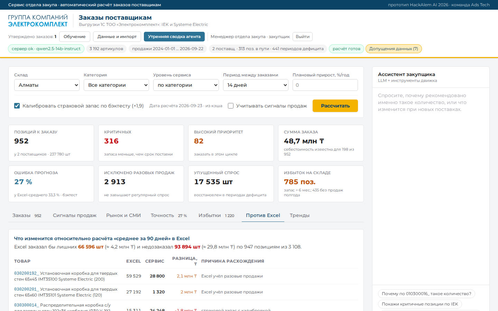

# Расчёт заказов поставщикам · ТОО «Электрокомплект»

**Менеджер отдела закупа получает готовый список заказов поставщикам с обоснованием по каждой позиции за секунды вместо 3–4 часов в Excel, а разовые крупные продажи и периоды дефицита больше не искажают расчёт.**

`HackAlem AI 2026` · `Трек 05 · Логистика` · `Кейс ТОО «Электрокомплект» (ekt.kz)` · `Команда Ads Tech` · Статус: **работает, проверено 23.09.2026 в 17:11 на чистом клоне (Docker с нуля, verify.sh OK, тесты: 10 зелёных + 1 пропущен без файлов партнёра)**

---

## 1. Быстрый старт (3 команды, ~3 минуты)

```bash
cp .env.example .env            # можно ничего не менять: DEMO_MODE=true работает без ключа LLM
docker compose up --build -d    # UI: http://localhost:8080   API: http://localhost:8000/api/health
bash scripts/verify.sh          # вход → расчёт → обоснование → what-if → агенты → экспорт; последняя строка OK
```

**Вход:** `manager` / `demo` (закупщик) или `admin` / `admin` (администратор: интеграции, журнал действий, мониторинг СМИ). При первом входе запускается обучение с подсказками; повторно — кнопка «Обучение» в шапке.

**Что вы увидите:** дашборд менеджера закупа. По умолчанию на синтетических данных (72 артикула, 6 поставщиков, 44 позиции к заказу с калиброванным запасом, 41 без калибровки); с выгрузками партнёра (см. раздел 3) — 3 192 артикула IEK и Systeme Electric, около 1 080 позиций к заказу с калиброванным страховым запасом (около 770 без калибровки). У каждой строки количество (редактируемое), срочность и обоснование словами; по клику на артикул — график продаж по месяцам с разовыми продажами и периодами дефицита, what-if; кнопки «Утвердить заказ» и «Экспорт XLSX / CSV для 1С»; справа ассистент, который объясняет расчёт через инструменты движка.

| Дашборд (данные партнёра) | Карточка артикула | Ассистент |
|---|---|---|
|  |  |  |
| **Вход** | **Обучение с подсказками** | **Журнал действий** |
|  |  |  |
| **Агент сигналов продаж** | **Агент мониторинга СМИ** | **Интеграции** |
|  |  |  |
| **Точность прогноза (бэктест)** | **Избытки и мёртвый запас** | **Сравнение с Excel** |
|  |  |  |

Без Docker: см. [раздел 7](#7-запуск). С ключом OpenAI (`DEMO_MODE=false`) ассистент отвечает на свободные вопросы; без ключа он тоже работает, но по шаблонам.

---

## 2. Проблема и решение

**Для кого.** Менеджер отдела закупа дистрибьютора электротоваров: ~70–2000 артикулов, 6+ поставщиков со сроками поставки от 7 до 45 дней, два склада.

**Боль в цифрах.** Расчёт потребности делается вручную в Excel, поэтому редко (раз в месяц) и не в реальном времени. Разовая продажа 1 500 шт одному клиенту завышает «средний спрос» на месяцы вперёд; период дефицита, наоборот, занижает его, потому что продаж не было. Итог: избыток по одним позициям, дефицит и упущенные продажи по другим.

**Решение.** Сервис, который по истории продаж, остаткам, товарам в пути, периодам дефицита, справочнику поставщиков и планам прироста считает рекомендованные заказы, группирует их по поставщикам и объясняет каждую цифру. Менеджер проверяет, корректирует, утверждает и выгружает в 1С. Ничего не отправляется поставщику автоматически.

**Результат «до / после».**

| | Было | Стало |
|---|---|---|
| Время расчёта по складу | 3–4 часа в Excel, раз в месяц | ≈ 10 с на 3 192 артикула партнёра (1 с на синтетике), результат кэшируется; хоть каждое утро |
| Разовый заказ 1 500 шт одному клиенту | завышает регулярную потребность | исключён из регулярного спроса, помечен, показан отдельно |
| 10 дней дефицита по позиции | «спроса не было» → занижение | упущенный спрос оценён и добавлен |
| Сезонность освещения | усреднена | восстановлена из данных: ноябрь ×1,27, июнь ×0,72 (в синтетике заложено 1,35 и 0,70); прогноз по месяцам горизонта поставки |
| Обоснование | в голове менеджера | текст с числами по каждой строке, экспортируется |
| Когда заказывать | «когда вспомним» | дата «заказать до» по каждой позиции с учётом срока поставки |
| Точность прогноза | Excel-среднее: 33,3 % ошибки на регулярном спросе | 27,0 % на месяцах, которые модель не видела (бэктест на данных партнёра) |
| Избыточные запасы | не видны | отчёт: 785 позиций с покрытием > 6 мес. и 435 без продаж полгода (данные партнёра) |

**Что реализовано за соревновательную часть (13:00–18:00, 23.09.2026):**
- [x] Движок расчёта: выбросы → упущенный спрос → сезонность и тренд → прогноз на горизонт поставки → страховой запас → потребность с кратностью и MOQ → срочность → обоснование
- [x] Синтетический датасет в формате выгрузки 1С с известной «правдой» (сезонность, рост, дефициты, разовые заказы)
- [x] 11 автотестов: 5 проверок «must have» из ТЗ, запрет автоотправки, цикл агента, импорт данных партнёра, бэктест точности, вход и журнал действий, агент сигналов продаж
- [x] Детектор разовых заказов проверен на «правде»: из 11 вставленных в синтетику разовых заказов найдены все 11, ложных срабатываний 0 ([алгоритм](#алгоритм-исключения-разовых-крупных-заказов-выбросов))
- [x] Честный бэктест вне выборки: ошибка прогноза против Excel-подхода и других методов, калибровка страхового запаса по фактическим ошибкам, надёжность прогноза по каждому артикулу
- [x] API: расчёт, список по поставщикам, детали артикула с рядами, what-if, утверждение, экспорт CSV/XLSX, загрузка своих CSV
- [x] LLM-ассистент с инструментами (числа только из движка), DEMO-режим без ключа
- [x] Вход в систему с ролями, журнал действий, администрирование интеграций (1С OData, Bitrix24, LLM) с проверкой соединения, обучение с подсказками
- [x] Агент сигналов продаж (чаты Telegram, WhatsApp, Bitrix24) и агент мониторинга СМИ (ленты Казахстана, 14 полей)
- [x] Утренний агент-закупщик: сам проходит по инструментам (расчёт → критичные и дефицит → избытки → проверка данных) и готовит сводку «что сделать сегодня»; человек утверждает
- [x] Дашборд менеджера (React): фильтры, сводка, эффект vs Excel, таблица по поставщикам с редактируемым количеством и обоснованием, карточка артикула с графиком и what-if, утверждение, экспорт, панель ассистента
- [x] Импортёр реальных выгрузок 1С партнёра (IEK, Systeme Electric): 12 файлов → формат движка одной командой или кнопкой «Импорт выгрузок 1С» в интерфейсе
- [x] Для бизнеса: дата «заказать до» и ожидаемая дата дефицита по каждой позиции, сумма заказа по себестоимости, плановый прирост спроса как параметр, отчёт «избыточные и мёртвые запасы» (деньги, замороженные на складе), черновик письма поставщику после утверждения, тренды спроса по категориям

---

## 3. Основной сценарий (что проверять)

| Шаг | Действие | Что должно произойти |
|---|---|---|
| 1 | Открыть http://localhost:8080, войти `manager` / `demo` | Экран входа в стиле ЭК; после входа обучение из 15 шагов (можно пропустить), в шапке `backend: ok` и сводка данных (72 артикула, продажи 2024-09…2026-08) |
| 2 | Склад «Главный», нажать «Рассчитать» | Сводка: 44 позиции, 6 поставщиков, 19 критичных (41 позиция, если снять галочку калибровки запаса); таблица сгруппирована по поставщикам |
| 3 | Раскрыть «Почему?» у строки `LMP-006 Светильник ДВО 36W` | Обоснование: спрос 2,2 шт/день, сезонный коэффициент сентября 1,04, план +12 %/год, прогноз на 59 дн. = 148 шт, страховой запас 42 с калибровкой ×1,7, ошибка прогноза на бэктесте 16 % (надёжность высокая), остаток 19, кратность 100 и MOQ 200 → 200, «критично, заказать до …» |
| 4 | Открыть детали `LMP-011` | График: столбцы продаж, маркер разовой продажи (75 шт, z=47.9), пунктир прогноза на 6 месяцев; в обосновании число исключённых разовых продаж, их объём и причина (1 продажа, 75 шт, «робастный z=47.9») |
| 5 | Открыть детали `TLS-010` | Заштрихованный период дефицита, в обосновании «учтён упущенный спрос» |
| 6 | Спросить ассистента «почему по LMP-006 такое количество?» | Шаг `explain_sku` в панели, ответ с числами, `latency_ms` |
| 7 | Изменить количество, нажать «Утвердить заказ» поставщику | Подтверждение, заказ появляется в «Утверждённых», надпись «не отправляется автоматически», кнопка «Письмо поставщику» показывает черновик |
| 8 | «Экспорт XLSX» | Файл `orders-….xlsx` с колонками Поставщик, Артикул, Наименование, Количество, Срочность, Обоснование |
| 9 | Раскрыть «Избыточные и «мёртвые» запасы» | Топ позиций с покрытием > 6 месяцев и без продаж 6 месяцев, в штуках и тенге |
| 10 | Ввести «Плановый прирост 15» и пересчитать | Итоговые количества растут, в обосновании появляется «план прироста +15%/год» |
| 11 | «Импорт выгрузок 1С (xlsx)», выбрать 12 файлов партнёра | Данные заменяются на реальные, идёт предрасчёт, затем «Рассчитать» |
| 12 | «Утренняя сводка агента» в шапке | Агент проходит 4 шага (видны с временем) и выдаёт сводку: что в дефиците, что заказать на неделе, что не заказывать |

**Данные партнёра (основной режим демо).** Выгрузки 1С ТОО «Электрокомплект» по поставщикам IEK и Systeme Electric (12 файлов Excel: динамика продаж по накладным, помесячные продажи и остатки за 2024–2026, MOQ, товар в пути на 22.09.2026, сезонность) импортируются одной командой в формат движка:
```bash
cd backend && .venv/bin/python -m app.import_partner --iek "/путь/IEK" --se "/путь/Systeme electric" --out data/partner
# затем в .env: DATA_DIR=data/partner; для Docker дополнительно раскомментировать volume ./backend/data/partner в docker-compose.yml
```
Что делает импортёр и какие допущения принимает, описано в шапке [backend/app/import_partner.py](backend/app/import_partner.py): клиент в выгрузке отсутствует, поэтому «крупная продажа одному клиенту» определяется по одной накладной; остатки IEK на 23.09 = остаток на 01.09 минус сентябрьские отгрузки; ETA товара в пути IEK из заголовков «поступление до …»; периоды дефицита выводятся из помесячных остатков. Сами файлы партнёра в репозиторий не включены (коммерческие данные), папка `backend/data/partner/` в `.gitignore`. Объём: 3 192 артикула, ~250 тыс. накладных, 774 тыс. строк после дозаполнения 2024 года из помесячной таблицы. Полный расчёт ≈ 10 с (параллельно по артикулам), выполняется при старте и кэшируется; бэктест при первой загрузке данных ≈ 45 с, тоже кэшируется.

**Тестовые данные (без файлов партнёра):** `backend/data/sample/` — синтетика с реалистичной структурой (разрешено ТЗ), генератор `backend/app/synth.py`, seed 42. Клиенты обезличены (`C001…C200`). Файл `_truth_oneoffs.csv` содержит «правду» о вставленных разовых заказах для проверки. По умолчанию (`DATA_DIR=data/sample`) сервис стартует на ней, чтобы запускаться у экспертов без файлов партнёра.

**Проверка через API** (все `/api/*`, кроме `/api/health` и `/api/auth/login`, требуют токен; без него ответ `401`). Артикулы LMP-006 и LMP-011 есть в синтетике (`DATA_DIR=data/sample`, по умолчанию):
```bash
TOKEN=$(curl -s -X POST localhost:8000/api/auth/login -H 'Content-Type: application/json' -d '{"username":"manager","password":"demo"}' | python3 -c "import sys,json; print(json.load(sys.stdin)['token'])")
A="Authorization: Bearer $TOKEN"
curl -s -X POST localhost:8000/api/replenish/run -H "$A" -H 'Content-Type: application/json' -d '{}' | python3 -c "import sys,json; d=json.load(sys.stdin); print(d['summary'])"
curl -s -H "$A" localhost:8000/api/sku/LMP-011 | python3 -c "import sys,json; d=json.load(sys.stdin); print(d['justification']); print(d['outliers'])"
curl -s -X POST localhost:8000/api/replenish/whatif -H "$A" -H 'Content-Type: application/json' -d '{"sku":"LMP-006","in_transit":200}' | python3 -c "import sys,json; print(json.load(sys.stdin)['delta_qty'])"
curl -s "localhost:8000/api/export?format=csv&token=$TOKEN" | head -3
```
Ожидаемо на синтетике: 44 позиции, 6 поставщиков, 19 критичных; у LMP-011 одна исключённая продажа 75 шт; what-if даёт `-200`; первая строка CSV — заголовок с колонками для 1С.

**Автотесты must-have (ТЗ, п. 7):**
```bash
cd backend && .venv/bin/python -m pytest tests -q      # или: docker compose exec backend python -m pytest tests -q
```

| Проверка из ТЗ | Тест |
|---|---|
| 1. Все источники данных влияют на результат (в пути, остатки, срок поставки, план прироста, история, категории) | `test_all_inputs_matter` |
| 2. Сезонность и устойчивый рост, а не среднее | `test_seasonality_and_growth` |
| 3. Упущенный спрос в stockout корректирует потребность вверх | `test_stockout_compensation` |
| 4. Вброшенный разовый крупный заказ (40× медианы дня, один клиент) помечается и не увеличивает регулярный прогноз больше чем на 10 %, тогда как наивное среднее растёт | `test_outlier_excluded` |
| 5. Группировка по поставщикам, обоснование в каждой строке | `test_grouped_with_justification` |
| Ограничение: без автоотправки | `test_no_auto_send` |
| Агент вызывает инструменты движка, числа только из них | `test_agent_loop.py` |
| Прогноз точнее простых методов вне выборки, калибровка повышает покрытие | `test_backtest.py` |
| Импорт 12 файлов партнёра (запускается, если файлы есть локально) | `test_partner_import.py` |
| Вход с ролями, запрет админ-разделов закупщику, запись действий в журнал | `test_auth_admin.py` |
| Агент сигналов продаж: разбор чатов трёх каналов, привязка к артикулу, имена клиентов не попадают в цитаты, сигнал увеличивает заказ только по галочке | `test_agents_signals_news.py` |

---

## 4. Как это работает

### Архитектура

```
┌──────────────┐  HTTP /api   ┌───────────────────────────────┐   OpenAI-compatible   ┌───────────┐
│  Frontend    │ ───────────▶ │  Backend FastAPI              │ ────────────────────▶ │  LLM      │
│  React+Vite  │              │  ┌─────────────────────────┐  │   (только объяснения) │  OpenAI / │
│  дашборд     │ ◀─────────── │  │ replenish.py  движок    │  │ ◀──────────────────── │  NVIDIA   │
│  :8080       │              │  │ детерминированный       │  │                       └───────────┘
└──────────────┘              │  └─────────────────────────┘  │
                              │  tools.py  инструменты агента │
                              │  state.py  датасет, результат │
                              │  backtest.py  выбор модели,   │
                              │     калибровка запаса         │
                              │  agent.py · signals.py ·      │
                              │     news.py  агенты           │
                              │  auth.py · audit.py  вход,    │
                              │     журнал действий           │
                              │  import_partner.py  1С → CSV  │
                              └───────────────┬───────────────┘
                                              │ CSV в формате выгрузки 1С
                                              ▼
                     sales · stock · in_transit · stockouts · suppliers · products
```

Принцип: **числа считает детерминированный движок, LLM только объясняет и отвечает на вопросы через инструменты.** Поэтому результат воспроизводим, объясним и не зависит от доступности модели.

### Методология расчёта (по каждому артикулу и складу)

1. **Выявление разовых крупных заказов.** Правило A: робастный z-score по медиане и MAD дневных продаж. Правило B: один клиент дал большую часть необычно крупного месяца. Помеченные продажи в регулярном спросе заменяются типичным объёмом, сами заказы показываются отдельно. Подробно, с параметрами и проверкой: [«Алгоритм исключения разовых крупных заказов»](#алгоритм-исключения-разовых-крупных-заказов-выбросов).
2. **Упущенный спрос в периоды дефицита.** Для каждого stockout-периода ожидаемый дневной спрос берётся как среднее за 28 дней до и после (исключая другие дефициты); разница с фактом даёт `lost_demand_qty`. Дополнительно уровень спроса умножается на коэффициент `Σ(с импутацией)/Σ(факт)` за последние 12 месяцев, чтобы дефицит не занижал прогноз.
3. **Сезонность и тренд.** Очищенный ряд агрегируется по месяцам. Сезонные индексы: отношение факта к линейному тренду, усреднённое по месяцам года, две итерации, нормировка к среднему 1, сжатие к 1 при истории < 24 мес и отключение при < 18 мес. Тренд: линейная регрессия по десезонализированному ряду; рост в %/мес принимается только при R² ≥ 0.2 («устойчивый»), иначе уровень = среднее последних 6 месяцев. К историческому росту прибавляется план прироста категории из справочника (`growth_plan_pct_year`).
   **Выбор модели по бэктесту.** Движок держит четыре варианта: (а) сезонность артикула + линейный тренд; (б) сезонность артикула, усреднённая 50/50 с сезонностью его категории, + уровень за последние 6 месяцев; (в) то же + устойчивый рост; (г) то же + половина роста. Какой вариант работает для всего ассортимента, решает бэктест на истории компании при каждой загрузке данных (раздел «Точность прогноза»). На данных партнёра выбран вариант (б), на синтетике с заложенным ростом — вариант (а). Переключение модели по каждому артикулу проверено и отклонено: на коротких окнах оно переобучается.
4. **Прогноз на горизонт.** Горизонт `H = срок поставки + период между заказами` (по умолчанию 14 дн.). Спрос суммируется по месяцам горизонта с учётом сезонного индекса каждого месяца и роста.
5. **Страховой запас.** `z(уровень сервиса) · σ(недельный спрос за 26 недель, без сезонности) · √(H/7) · k`, где `k` — множитель калибровки по бэктесту (см. раздел «Точность прогноза»): без него обещанные 95 % на данных партнёра фактически давали 87 %. Калибровку можно выключить галочкой в интерфейсе. Уровень сервиса по категории (Автоматика 98 %, Кабель/Освещение/Розетки 95 %, Щиты/Инструмент 90 %) или заданный вручную.
6. **Потребность.** `прогноз + страховой − остаток − в пути (ETA ≤ H)`, округление вверх до кратности упаковки, минимум MOQ (артикула, иначе поставщика). Если ≤ 0 — заказ не нужен. Если включена галочка «Учитывать сигналы продаж», добавляется ожидаемый в горизонте спрос из чатов продажников × вероятность (агент сигналов); без галочки сигнал только показывается в обосновании.
7. **Срочность.** Дней покрытия = `(остаток + в пути)/прогноз в день`: `critical` если меньше срока поставки, `high` если меньше горизонта, иначе `normal`.
8. **Обоснование.** Шаблонный текст с фактическими числами по шагам 1–7 для каждой строки (не требует LLM), включая ошибку прогноза этого артикула на бэктесте и метку надёжности: высокая (≤ 25 %), средняя (≤ 50 %), низкая, либо «штучный спрос» (< 10 шт в месяц, где процентная ошибка неинформативна).

**Срок поставки IEK** взят из данных: взвешенная медиана «дата документа → дата поступления» по 306 строкам «Путь ИЭК» = 24 дня. Для Systeme Electric дат нет, принято 30 дней. Все допущения импорта видны в интерфейсе кнопкой «Допущения данных».

### Алгоритм исключения разовых крупных заказов (выбросов)

Задача по ТЗ: разовая крупная продажа, в том числе большая продажа одному клиенту, не должна попадать в регулярную потребность. Считается отдельно для каждой пары «артикул × склад» по всей истории продаж. Код: `detect_outliers` в [backend/app/replenish.py](backend/app/replenish.py).

**База «обычного» спроса.** По дням, в которые были продажи, считаются медиана дневного объёма `m` и MAD (медиана абсолютных отклонений от `m`). Медиана и MAD вместо среднего и σ, потому что сам выброс их почти не сдвигает. Если MAD = 0, берётся `max(0,25·m, 1)`. Типичный объём `t = max(m, 1)`.

**Правило A: аномально крупная продажа.** Транзакция помечается, если выполнены все три условия:
- робастный z-score `0,6745·(qty − m)/MAD > 5`;
- `qty > 8·t`;
- транзакция входит в верхний 1 % размеров транзакций этого артикула. Это условие работает при истории от 20 транзакций, при меньшей правило A не применяется. Оно добавлено после прогона на данных партнёра: без него на трубах и коробках отсекались десятки регулярных оптовых накладных, например кабель бухтами.

**Правило B: крупная продажа одному клиенту.** По каждому месяцу: если один клиент дал ≥ 60 % продаж месяца, месяц больше 2× медианного месяца, а объём клиента за месяц > `8·t`, помечаются его транзакции этого месяца крупнее `t`. В выгрузках партнёра клиента нет, поэтому клиент здесь = накладная (одна накладная = один заказ одного покупателя).

**Что происходит с помеченной продажей.**
- В регулярном спросе она заменяется типичным объёмом `min(qty, t)`, а не удаляется: удаление обнулило бы день и занизило спрос.
- Сам заказ не теряется: он виден маркером на графике артикула, в поле `outliers` ответа `GET /api/sku/{sku}` и в обосновании строки («исключено N разовых продаж на X шт» и причина, например «робастный z=47.9» или «72% спроса месяца одним клиентом»).
- Строки 2024 года, дозаполненные из помесячной таблицы партнёра (`client_id = MONTHLY`), никогда не помечаются.
- Известный заранее будущий крупный заказ учитывается отдельно, не через историю: агент сигналов продаж и галочка «Учитывать сигналы продаж».

**Параметры.** z-порог 5 (`Params.outlier_z`), доля клиента 0,6 (`Params.outlier_client_share`); кратность 8× и верхний 1 % заданы в коде.

**Проверка.**

| Проверка | Результат |
|---|---|
| Синтетика: 11 разовых заказов, вставленных генератором (15–29× обычного объёма, «правда» в `_truth_oneoffs.csv`) | найдены 11 из 11, ложных срабатываний 0 |
| Автотест `test_outlier_excluded`: в артикул без выбросов вброшен заказ 40× медианы дня | помечен; регулярный прогноз вырос меньше чем на 10 %, наивное среднее выросло бы заметно |
| Данные партнёра, 3 192 артикула | помечено 6 612 накладных по 1 570 артикулам, около 21 % проданных штук; 6 366 по правилу A, 246 по правилу B |
| Бэктест вне выборки | прежняя модель без очистки ошибается на 72,5 %, с очисткой 29,4 % (раздел «Точность прогноза») |

Воспроизвести проверку на синтетике (≈ 2 с; в Docker: `docker compose exec backend python -c "…"`):
```bash
cd backend && .venv/bin/python -c "
import pandas as pd; from app.replenish import Dataset, detect_outliers
ds = Dataset.load('data/sample'); t = pd.read_csv('data/sample/_truth_oneoffs.csv')
f = pd.concat([detect_outliers(g, 5, 0.6)[0].query('is_outlier') for _, g in ds.sales.groupby(['sku', 'warehouse'])])
hit = t.merge(f.assign(date=f['date'].dt.strftime('%Y-%m-%d')), on=['sku', 'date', 'client_id'])
print('помечено', len(f), '| вставлено', len(t), '| найдено', len(hit), '| ложных', len(f) - len(hit))"
```

**Что стоит знать.**
- Пороги подобраны без закупщика партнёра. Около 21 % объёма в разовых заказах правдоподобно для проектных продаж электротоваров, но список помеченных накладных стоит пройти вместе с закупщиком.
- Правило A не смотрит на повторяемость: покупатель, который регулярно берёт большие партии, попадёт в разовые. С идентификатором клиента из 1С это отсекается проверкой повторяемости, это следующий шаг.
- Дозаполненные строки 2024 года сами не помечаются, но участвуют в расчёте медианы и порога 1 %. Мелкие равномерные дни делают детектор строже: без них было бы помечено 2 453 накладные вместо 6 612. С полной транзакционной историей из 1С эффект исчезнет.

### Точность прогноза: честный бэктест вне выборки

Как проверяли: берём два соседних окна по три месяца. На окне март–май 2026 модели обучаются только на данных до 1 марта, и по их ошибке выбирается вариант прогноза для всего ассортимента. Затем выбранный вариант обучается на данных до 1 июня и прогнозирует июнь, июль и август, которых он не видел. Метрика WAPE = Σ|прогноз − факт| / Σ факт, меньше лучше. Факт берётся без разовых заказов (регулярный спрос, который мы планируем), месяцы с дефицитом исключены. Воспроизвести: `cd backend && .venv/bin/python -m app.backtest --data data/partner` (≈ 45 с) или `GET /api/backtest`.

Данные партнёра, 1 183 регулярных артикула (продавались ≥ 8 из 12 месяцев):

| Метод | Окно выбора, март–май | Проверка, июнь–август | Смещение, июнь–август | Июнь–август к сырым продажам |
|---|---|---|---|---|
| **Выбрана и в работе: сезонность артикула и категории + уровень 6 мес.** | **30,7 %** | **27,0 %** | −8,6 % | 37,1 % |
| То же + половина устойчивого роста | 32,4 % | 27,6 % | −7,2 % | 36,6 % |
| То же + устойчивый рост | 34,8 % | 28,8 % | −5,5 % | 36,5 % |
| Прежняя модель: сезонность артикула + линейный тренд | 38,3 % | 29,4 % | −6,1 % | 38,3 % |
| Прежняя модель без очистки данных | 95,3 % | 72,5 % | +53,6 % | 54,2 % |
| Excel: среднее за 90 дней | 36,9 % | 33,3 % | +4,1 % | 31,1 % |
| Среднее за 12 месяцев | 59,3 % | 32,5 % | +9,7 % | 29,7 % |
| Тот же месяц прошлого года | 69,5 % | 82,0 % | +51,7 % | 65,8 % |

Выводы без приукрашивания:
- Выбранная модель точнее Excel-среднего на обоих окнах: 27,0 % против 33,3 % на месяцах, которые она не видела. Ошибка ниже почти на пятую часть.
- Прежняя единая модель была нестабильной: летом 29,4 %, но весной 38,3 %, хуже Excel. Сезонность одного артикула по двум годам истории шумит, поэтому теперь она усредняется с сезонностью категории, а уровень берётся за полгода.
- Устойчивый рост не выброшен: модели с ростом участвуют в выборе при каждой загрузке данных. На синтетике с заложенным ростом выбор падает на модель с трендом, 4,0 % против 14,9 % у Excel-среднего. На данных партнёра рост за последний год бэктестом не подтвердился.
- Главный вклад по-прежнему даёт очистка данных: без неё ошибка 72,5 %.
- В столбце «к сырым продажам» простые средние выглядят лучше. Это ожидаемо: сырые продажи включают разовые тендеры, которые мы по ТЗ исключаем из регулярной потребности и не держим на складе.
- Переключение модели по каждому артикулу проверено тем же способом и отклонено: на трёхмесячных окнах оно переобучается.
- Нерегулярные артикулы (продажи реже 8 из 12 месяцев) любой метод прогнозирует плохо: у нас ошибка около 101 %, у Excel-среднего около 94 %. Для них в интерфейсе метка «низкая надёжность» или «штучный спрос», их стоит проверять глазами. По всем артикулам вместе 28,2 % против 34,2 % у Excel.
- Страховой запас: классическая формула при цели 95 % фактически закрывала спрос у 87 % артикулов. Множитель, подобранный на окне март–май (×1,3), поднял покрытие на июне–августе до 90,6 %; в работе множитель ×1,9 по последнему окну. Цена: при калибровке к заказу ≈ 238 тыс. шт по 952 позициям, без неё ≈ 118 тыс. шт по 690 позициям; решение за менеджером (галочка в фильтрах).

### Ассистент и инструменты агента

| Инструмент | Что делает |
|---|---|
| `run_replenishment(warehouse, category)` | запускает расчёт, возвращает сводку по поставщикам |
| (API) `GET /api/replenish/overstock`, `GET /api/replenish/categories`, `GET /api/orders/{id}/email`, `POST /api/data/import_partner` | избыточные запасы, тренды по категориям, черновик письма, импорт xlsx партнёра (см. docs/API.md) |
| `explain_sku(sku)` | полный разбор позиции: прогноз, сезонность, тренд, выбросы, дефицит, запас |
| `list_orders(supplier, urgency)` | позиции с фильтрами |
| `what_if(sku, in_transit, stock, lead_time_days, service_level)` | пересчёт при изменении входов |
| `draft_supplier_email(supplier_id)` | черновик письма; отправки нет |
| Утренний агент `GET /api/agent/daily-brief` | автономный проход по инструментам: расчёт, критичные и нулевые остатки, что заказать на неделе, избытки, просроченный товар в пути → сводка (шаблон без LLM, живой текст с LLM) |

Цикл вызова инструментов в `backend/app/llm.py`, до 8 раундов; шаги показываются в UI. В `DEMO_MODE` ассистент отвечает по шаблонам через те же инструменты.

### Агенты сервиса

| Агент | Что делает | Где |
|---|---|---|
| **Ассистент закупщика** | Отвечает на вопросы обычными словами, сам выбирает инструменты движка: «Расчёт заказов», «Разбор позиции», «Поиск позиций в заказе», «Пересчёт что если», «Черновик письма». Шаги показаны человеческим языком, технические имена (`explain_sku`, `list_orders`…) и данные доступны раскрытием | правая панель |
| **Утренний агент** | Сам проходит расчёт, критичные позиции и дефицит, избытки, проверку данных и пишет «что сделать сегодня» | кнопка «Утренняя сводка агента» |
| **Агент сигналов продаж** | Читает выгрузки чатов продажников: Telegram (экспорт JSON), WhatsApp (экспорт .txt), общий чат Bitrix24 (CSV/JSON) или вставленный текст. Извлекает поля: дата, канал, менеджер, клиент (только хеш), тип сигнала (крупный разовый заказ, регулярный рост, снижение или отказ, перенос сроков, цены и условия поставщика, проблема у поставщика), товар и артикул, количество, ожидаемый месяц, вероятность, взвешенное количество, цитата. Сигналы не смешиваются с регулярным спросом (так требует ТЗ), а добавляются в заказ галочкой «Учитывать сигналы продаж» и видны пометкой в строке заказа | вкладка «Сигналы продаж», `POST /api/signals/import` |
| **Агент мониторинга СМИ** | Собирает ленты Tengrinews, Kapital.kz, LSM.kz, Profit.kz, Inform.kz, отбирает новости по ключевым словам и заполняет 14 полей: дата, источник, заголовок, ссылка, кратко, тема, категории товаров, поставщики, регион, влияние (рост спроса, спад, риск поставок, рост цен), сила, горизонт, релевантность, что сделать закупщику. Нерелевантное отсеивается. Источники и ключевые слова настраивает администратор | вкладка «Рынок и СМИ», `POST /api/news/refresh` |

Все агенты с ключом модели работают через LLM по строгой JSON-схеме, без ключа — по прозрачным правилам; числа всегда берутся из текста или движка, не выдумываются. Пример выгрузок из трёх каналов лежит в `backend/data/sample/chats/` (кнопка «Загрузить пример из трёх каналов»).

### Чат-бот «Закупщик» в Bitrix24

Наш ассистент может работать прямо в мессенджере Bitrix24: сотрудник пишет боту «почему по 010300016_ столько?», Bitrix24 пересылает сообщение на наш сервер (событие `ONIMBOTMESSAGEADD`), агент отвечает по числам движка методом `imbot.message.add`. Туда же по расписанию приходит утренняя сводка агента, а утверждение заказа может создавать задачу ответственному (`tasks.task.add`). Bitrix24 — только канал, модель под агентом любая. Настройка вебхука портала и проверка соединения — в администрировании; обработчик событий бота — следующий этап (схема в [docs/INTEGRATIONS.md](docs/INTEGRATIONS.md)).

### Вход, роли, журнал действий, администрирование

- **Вход и роли.** Закупщик: расчёт, обоснование, утверждение, экспорт, ассистент, агенты. Администратор: дополнительно интеграции, мониторинг СМИ, журнал действий, пользователи. Пользователи задаются `AUTH_USERS`; в эксплуатации — вход через Bitrix24 OAuth или корпоративный каталог.
- **Журнал действий.** Каждое действие пишется в `data/audit.jsonl`: вход и неудачные попытки, расчёт с параметрами, утверждение заказа, экспорт, импорт выгрузок и чатов, вопросы ассистенту, мониторинг СМИ, изменения интеграций. В администрировании — сводка, фильтры по пользователю и действию, поиск, выгрузка CSV.
- **Интеграции.** 1С OData (адрес, пользователь, пароль скрыт) и Bitrix24 (входящий вебхук, имя бота) с реальной проверкой соединения; статус языковой модели с проверкой ответа.
- **Обучение.** Пошаговый тур с подсветкой элементов и подсказками (15 шагов, с расчётом по ходу), запоминается после прохождения.

### Чем отличается от Excel и «просто ChatGPT»

- Робастная очистка выбросов и оценка упущенного спроса встроены в расчёт, а не делаются глазами.
- Каждая цифра объяснена и воспроизводима: одинаковые входы дают одинаковый результат, LLM не участвует в арифметике.
- What-if за секунду: изменил товар в пути, увидел новую потребность.
- Человек в цикле обязателен: утверждение перед экспортом, автоотправки нет.

### Независимость от поставщика LLM (важно для казахстанского бизнеса)

LLM не участвует в расчёте: движок, обоснования, экспорт и отчёты работают без модели (`DEMO_MODE=true`). Ассистент подключается к любому OpenAI-совместимому endpoint одной строкой в `.env`, поэтому компания может не покупать токены OpenAI:

| Вариант | `.env` | Когда |
|---|---|---|
| Локальная модель на своём сервере (данные не покидают компанию) | `LLM_BASE_URL=http://ollama:11434/v1`, `LLM_MODEL=qwen2.5:14b` (Ollama) или vLLM | продуктивная эксплуатация |
| NVIDIA NIM | `LLM_BASE_URL=https://integrate.api.nvidia.com/v1`, `LLM_MODEL=meta/llama-3.3-70b-instruct` | пилот, есть кредиты |
| OpenAI | `LLM_BASE_URL=https://api.openai.com/v1`, `LLM_MODEL=gpt-4.1-mini` | если разрешено политикой |
| Без LLM | `DEMO_MODE=true` | всегда доступно |
| **Проверено на демо:** своя модель в vLLM на NVIDIA L40S | `LLM_BASE_URL=http://<сервер>:8000/v1`, `LLM_MODEL=qwen2.5-14b-instruct` | так работал ассистент на демо 23.09 |

Как подняли свою модель (один GPU-сервер NVIDIA L40S 48 ГБ, облако NVIDIA Brev; подойдёт любой сервер с GPU от 40 ГБ и Docker):

```bash
docker run -d --name llm --gpus all --ipc=host -p 8000:8000 -v ~/hf:/root/.cache/huggingface \
  vllm/vllm-openai:v0.10.1.1 --model Qwen/Qwen2.5-14B-Instruct --served-model-name qwen2.5-14b-instruct \
  --api-key <ключ> --enable-auto-tool-choice --tool-call-parser hermes --max-model-len 32768
```

Замеры 23.09: модель занимает 27,6 ГБ видеопамяти, веса скачиваются и загружаются примерно за 5 минут, ответ ассистента с вызовом инструмента 3–10 с, утренняя сводка 12 с. Код не менялся, только `.env`.

Ассистент получает только агрегаты по позиции (прогноз, остаток, обоснование), а не транзакции и не данные клиентов.

**Нужно ли дообучать модель.** Нет: агенту не нужно «знать» ассортимент, все числа приходят из инструментов движка, а модель отвечает за понимание вопроса, выбор инструмента и русский текст. Дообучение (LoRA на логах хороших ответов) имеет смысл позже только для стиля и формата сводок, и то на небольшой модели. Расчётный движок GPU не требует вообще (сервер 4 CPU / 8 ГБ).

**Куда сажать модель, по этапам:**

| Этап | Модель | Железо | Стоимость |
|---|---|---|---|
| Пилот | та же модель, что пойдёт в внедрение: Llama 3.1 8B или Qwen2.5-14B через NVIDIA NIM API (`meta/llama-3.1-8b-instruct`, `qwen/qwen2.5-7b-instruct`); Llama 3.3 70B только как эталон для сравнения качества | нет, облачный API | доли тенге за вопрос; сводка раз в день; пилот проверяет ровно ту модель, что потом встанет на сервер |
| Внедрение on-prem | та же Llama 3.1 8B / Qwen2.5-14B в vLLM или Ollama, 4-bit; для tool calling достаточно | 1 GPU 24–48 ГБ (RTX 4090 / L4 / L40S), обычный сервер | один сервер, данные не покидают компанию; смена endpoint в `.env`, код не меняется |
| Если нужна 70B локально | Llama 3.3 70B, 4-bit/FP8 | 1× H100 80 ГБ или 2× L40S 48 ГБ | заметно дороже, выигрыш в качестве текста, не в цифрах |
| Минимум | 8B квантованная на CPU (llama.cpp) | сервер без GPU | медленно, но для утренней сводки раз в день достаточно |

### Надёжность и ограничения ТЗ

- Приватность: клиенты только как обезличенные ID; данные не покидают сервер, LLM получает агрегаты по позиции, не транзакции.
- Устойчивость к аномалиям: медиана/MAD вместо среднего/σ при поиске выбросов, клип тренда ±10 %/мес, клип коэффициента упущенного спроса ×1.5.
- Совместимость с учётной системой: вход и выход в CSV с колонками выгрузки 1С; XLSX для менеджера.

---

## 5. Технологии

| Слой | Технология | Версия |
|---|---|---|
| Backend | Python, FastAPI, Uvicorn | 3.12 / 0.115 / 0.34 |
| Расчёт | pandas, numpy | 2.2 / 2.2 |
| Экспорт | openpyxl | 3.1 |
| LLM (опционально) | Qwen2.5-14B-Instruct в vLLM на NVIDIA L40S (демо) или OpenAI API `gpt-4.1-mini`, через OpenAI-совместимый клиент; NVIDIA NIM как альтернатива | openai-python 1.59, vLLM 0.10.1.1 |
| Frontend | React, TypeScript, Vite, Tailwind CSS | 19 / 5.8 / 6 / 4 |
| Тесты | pytest | 8 |
| Деплой | Docker Compose, Nginx | v2 / alpine |

Полный список компонентов и лицензий: [THIRD_PARTY.md](THIRD_PARTY.md). AI-инструменты разработки: [AI_USAGE.md](AI_USAGE.md). Журнал решений: [docs/DECISIONS.md](docs/DECISIONS.md). Контракт API: [docs/API.md](docs/API.md).

---

## 6. Установка

**Системные требования:** Docker 24+ с Compose v2 (рекомендуется). Без Docker: Python 3.12, Node.js 20+. 2 ГБ RAM, 1 ГБ диска. Интернет не нужен при `DEMO_MODE=true`.

```bash
git clone https://github.com/BAITC-Hacks/hack-7d91ac57-ads-tech.git
cd hack-7d91ac57-ads-tech
cp .env.example .env
```

По умолчанию `DEMO_MODE=true`: расчёт, дашборд, экспорт и ассистент по шаблонам работают без ключа. Для свободных вопросов ассистенту впишите `LLM_API_KEY` и `DEMO_MODE=false`.

---

## 7. Запуск

**Вариант A — Docker, одна команда:**
```bash
docker compose up --build -d
```
Готовность: `docker compose ps` показывает `backend … (healthy)`. UI: http://localhost:8080. API: http://localhost:8000/api/health.

**Вариант B — локально, два терминала:**
```bash
make setup      # backend/.venv + frontend/node_modules
make backend    # API на :8000
make frontend   # UI на :5173, /api проксируется на :8000
```

**Остановка:** `docker compose down` (`-v` удалит утверждённые заказы).

---

## 8. Зависимости

- Backend: [backend/requirements.txt](backend/requirements.txt), версии зафиксированы.
- Frontend: [frontend/package.json](frontend/package.json), lock-файл в репозитории.
- Внешние сервисы: только OpenAI-совместимый LLM API, и только при `DEMO_MODE=false`.

---

## 9. Параметры окружения

Шаблон: [.env.example](.env.example). Файл `.env` в репозиторий не попадает.

| Переменная | Обязательна | По умолчанию | Описание |
|---|---|---|---|
| `DEMO_MODE` | нет | `true` | ассистент по шаблонам без LLM; расчёт не зависит от этого флага |
| `AUTH_ENABLED` | нет | `true` | вход в систему; `false` отключает проверку токена (только для отладки) |
| `AUTH_USERS` | нет | `manager:demo:manager:Менеджер отдела закупа,admin:admin:admin:Администратор` | пользователи `логин:пароль:роль:имя` через запятую |
| `AUTH_SECRET` | нет | случайный при старте | ключ подписи токенов; задайте, чтобы сессии переживали перезапуск |
| `LLM_API_KEY` | только при `DEMO_MODE=false` | — | ключ OpenAI-совместимого провайдера |
| `LLM_BASE_URL` | нет | `https://api.openai.com/v1` | для NVIDIA: `https://integrate.api.nvidia.com/v1` |
| `LLM_MODEL` | нет | `gpt-4.1-mini` | модель для ассистента |
| `DATA_DIR` | нет | `data/sample` | папка с CSV: `data/sample` (синтетика) или `data/partner` (импорт выгрузок партнёра) |
| `TODAY` | нет | последняя дата продаж + 1 | дата расчёта, ISO |
| `CORS_ORIGINS` | нет | localhost | разрешённые origin |
| `API_PORT` / `WEB_PORT` | нет | `8000` / `8080` | порты на хосте для Docker |

---

## 10. Проверка

1. `bash scripts/verify.sh` — health, расчёт, обоснование позиции с разовой продажей, what-if, агент и ассистент, экспорт. Артикулы выбираются из текущего расчёта, поэтому скрипт работает и на синтетике, и на данных партнёра. Последняя строка `OK`.
2. Пройти [основной сценарий](#3-основной-сценарий-что-проверять) в UI.
3. `cd backend && .venv/bin/python -m pytest tests -q` — 11 тестов: все зелёные, тест импорта партнёра пропускается, если файлов партнёра нет (тогда 10 passed, 1 skipped).
4. `cd backend && .venv/bin/python -m app.backtest` — бэктест точности на синтетике (≈ 12 с), с `--data data/partner` на данных партнёра.
5. Загрузить свой CSV (кнопка «Загрузить CSV» или `POST /api/data/upload`), пересчитать: результат меняется.

### Если не запускается

| Симптом | Решение |
|---|---|
| Порт 8000 или 8080 занят | в `.env`: `API_PORT=8001`, `WEB_PORT=8090` |
| `backend` не становится `healthy` | `docker compose logs backend`; первый запуск генерирует данные ~20 с, если папка `data/sample` пуста |
| `401`/`429` от LLM в логах | `DEMO_MODE=true` либо проверить ключ; расчёт при этом работает |
| Нет Docker | вариант B из раздела 7 |
| Свой CSV не загружается | проверьте колонки: `sales: date,sku,qty,client_id,price,warehouse`; разделитель `,` или `;`; кодировка UTF-8 |

---

## 11. Ограничения и развитие

**Известные ограничения (на 18:00 23.09):**
- Пороги выбросов (z > 5, доля клиента 60 %) подобраны без закупщика; их стоит откалибровать вместе с ним на полной истории. Синтетический набор оставлен для автотестов и режима без данных партнёра.
- Прогноз: четыре варианта модели, вариант для всего ассортимента выбирается бэктестом при каждой загрузке данных. Выбор по каждому артикулу проверен и отклонён. Holt-Winters, SARIMA и градиентный бустинг стоит проверить тем же бэктестом на более длинной истории.
- Ошибка прогноза нерегулярных артикулов высокая (~100 %, у Excel-среднего ~94 %); для них нужна отдельная политика (min-max, Croston), сейчас они помечены низкой надёжностью.
- Калибровка запаса опирается на два окна по три месяца; множитель между окнами различается (×1,3 и ×1,9), его стоит пересчитывать ежемесячно.
- Товары в пути учитываются, если ETA попадает в горизонт; частичные поставки не моделируются.
- Утверждённые заказы хранятся в JSON-файле, не в учётной системе; запись в 1С и задачи в Bitrix24 описаны как следующий шаг (docs/INTEGRATIONS.md), не реализованы.

**Дальнейшее развитие:**
- Интеграция с 1С через стандартный OData-интерфейс (чтение номенклатуры, продаж, остатков, заказов поставщику; запись утверждённого заказа документом «Заказ поставщику») и с Bitrix24 через REST (задача на согласование, уведомление о дефиците в чат отдела закупа, карточки поставщиков). Контракт адаптеров и маппинг объектов: [docs/INTEGRATIONS.md](docs/INTEGRATIONS.md), каркас в `backend/app/integrations.py`; движок от источника данных не зависит. Наш ассистент может работать внутри Bitrix24 как чат-бот «Закупщик» (`imbot` + событие `ONIMBOTMESSAGEADD`) или как AI-движок BitrixGPT (`ai.engine.register`): Bitrix24 только канал, отвечает наш агент с инструментами движка.
- Приоритизация по стоимости дефицита (маржа × упущенные продажи), дифференцированный уровень сервиса по ABC/XYZ вместо единого множителя, учёт условий поставщика (скидки от объёма, кратность паллет).
- Масштаб: одна компания → сеть филиалов → другие дистрибьюторы; движок не зависит от товарной категории.
- Рассылка утверждённых заказов поставщикам после подтверждения (по ТЗ только с подтверждением сотрудника).

---

## 12. Команда

| Участник | Роль на хакатоне | GitHub |
|---|---|---|
| Дархан Нурикенов (соло) | продукт, архитектура, движок расчёта, импорт данных партнёра, API, дашборд, тесты, README | [@Nurikenov](https://github.com/Nurikenov) |

---

## Соответствие требованиям Положения (п. 5.4.15) и ТЗ (п. 10)

| Требование | Раздел |
|---|---|
| Описание решения и назначения | 2 |
| Описание архитектуры | 4 |
| Методология расчёта, алгоритм исключения выбросов (ТЗ п. 10) | 4 «Методология» |
| Используемые технологии | 5 |
| Инструкции по установке | 6 |
| Инструкции по запуску | 1, 7 |
| Необходимые зависимости | 8 |
| Параметры окружения | 9 |
| Порядок проверки основного сценария | 3, 10 |

Сторонние компоненты раскрыты в [THIRD_PARTY.md](THIRD_PARTY.md) (п. 5.4.4). Инфраструктурный шаблон (структура репозитория, Docker, каркас FastAPI/React, обёртка над LLM) подготовлен до старта и не содержит доменной функциональности (п. 5.4.4.2); движок расчёта, данные, API, тесты и дашборд созданы 23.09.2026 13:00–18:00, см. историю коммитов.
